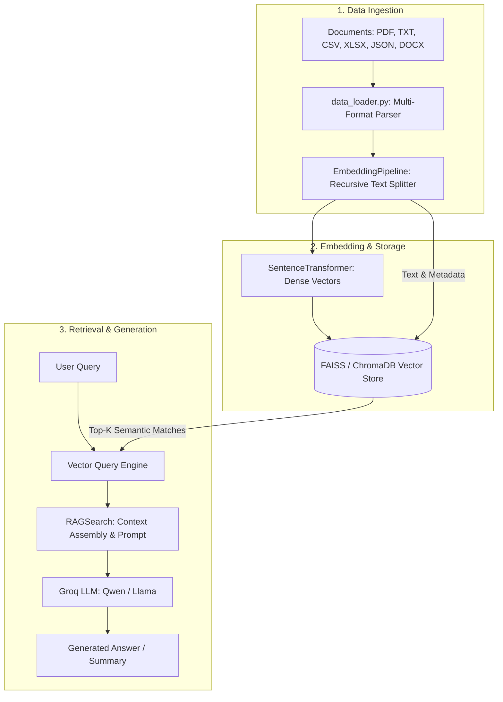

# 🧠 Advanced & Vectorless RAG (Retrieval-Augmented Generation)

[](https://www.python.org/)
[](https://www.langchain.com/)
[](https://github.com/facebookresearch/faiss)
[](https://groq.com/)
[](https://pageindex.ai/)

A modular, production-ready framework exploring both **Advanced Vector-based RAG** (multi-format document ingestion, dense semantic embeddings, persistent FAISS/Chroma vector stores, Groq LLMs) and **Vectorless RAG** (hierarchical tree indexing via PageIndex).

---

## 📑 Table of Contents

- [Overview](#-overview)
- [Key Features](#-key-features)
- [Architecture & Flow](#-architecture--flow)
- [Vector vs. Vectorless RAG](#-vector-vs-vectorless-rag)
- [Project Structure](#-project-structure)
- [Getting Started](#-getting-started)
  - [Prerequisites](#prerequisites)
  - [Installation](#installation)
  - [Environment Variables](#environment-variables)
- [Usage Guide](#-usage-guide)
  - [1. Data Ingestion & Indexing](#1-data-ingestion--indexing)
  - [2. Vector Querying & LLM Generation](#2-vector-querying--llm-generation)
  - [3. Vectorless RAG (PageIndex)](#3-vectorless-rag-pageindex)
- [Core Components Breakdown](#-core-components-breakdown)
- [Roadmap](#-roadmap)

---

## 🚀 Overview

Standard RAG architectures often suffer from chunking context loss, embedding drift, or inability to handle multi-structured files. This repository addresses these challenges by implementing:

1. **Advanced Dense Vector RAG Pipeline:** Object-oriented document loaders across 6+ formats, optimized text chunking with boundary awareness, embedding management with dimension validation, persistent FAISS storage, and high-speed generation using Groq.
2. **Vectorless & Structural RAG:** Tree-based document indexing (PageIndex) that bypasses vector similarity bottlenecks for complex layout-heavy documents, technical notes, and reasoning tasks.

---

## ✨ Key Features

- **Multi-Format Ingestion:** Native loaders for `.pdf` (PyMuPDF/PyPDF), `.txt`, `.csv`, `.xlsx`, `.json`, and `.docx`.
- **Modular Embedding Management:** Encapsulated `EmbeddingPipeline` with `sentence-transformers` (`all-MiniLM-L6-v2`) ensuring single-load model lifecycle and batch inference.
- **Persistent Vector Store:** Lightweight, high-performance vector indexing using `FAISS` with metadata serialization (`pickle`) and fallback support for `ChromaDB`.
- **Ultra-Fast LLM Inference:** Integrated with `ChatGroq` for high-throughput generation (e.g., `qwen/qwen3.8-27b`, Llama 3).
- **Vectorless Indexing (PageIndex):** Document tree structures preserved for hierarchical context retrieval without embedding loss.
- **Interactive Jupyter Exploration:** Hands-on notebooks for document inspection, embedding benchmarks, and vectorless tree evaluation.

---

## 🏗 Architecture & Flow

### 1. Vector RAG Pipeline



---

## ⚖ Vector vs. Vectorless RAG

| Feature | Vector RAG (`FAISS` / `ChromaDB`) | Vectorless RAG (`PageIndex`) |
| :--- | :--- | :--- |
| **Search Mechanism** | Dense embedding cosine / L2 similarity | Hierarchical tree traversal & structural indexing |
| **Best For** | Large text corpora, general semantic queries | Long structured PDFs, manuals, nested documents |
| **Loss of Context** | Possible due to fixed chunk boundaries | Minimal (maintains document hierarchy & page context) |
| **Storage Engine** | FAISS index + metadata PKL | PageIndex cloud tree index |
| **LLM Integration** | Groq (`ChatGroq`) | OpenAI / Groq Reasoning LLMs |

---

## 📂 Project Structure

```text
├── data/                                # Source documents (PDFs, TXT, CSV, etc.)
├── faiss_store/                         # Persisted FAISS index & metadata
│   ├── faiss.index
│   └── metadata.pkl
├── notebook/                            # Step-by-step exploratory notebooks
│   ├── 01_document.ipynb                # Document loading & parsing benchmarks
│   ├── 02_pdf_loader.ipynb              # Chunking, embeddings & ChromaDB indexing
│   └── 03_pageindex_Vectorless_RAG.ipynb# Vectorless RAG using PageIndex tree index
├── src/                                 # Core source code package
│   ├── __init__.py
│   ├── data_loader.py                   # Universal multi-file format loader
│   ├── embedding.py                     # Chunking & SentenceTransformer pipeline
│   ├── vectorstore.py                   # FAISS vector store manager & similarity search
│   └── search.py                        # RAG query & Groq LLM synthesis engine
├── app.py                               # Application entry point / pipeline runner
├── main.py                              # Minimal execution script
├── pipeline.md                          # Comprehensive system design document
├── error_faced_and_learning.md          # Troubleshooting notes & lessons learned
├── pyproject.toml                       # Project metadata & dependencies
├── requirements.txt                     # Standard pip dependencies
└── README.md                            # Project documentation
```

---

## 🛠 Getting Started

### Prerequisites

- Python `3.10+` (or `3.11` / `3.12` recommended)
- [uv](https://github.com/astral-sh/uv) (recommended) or standard `pip`

### Installation

1. **Clone the repository:**
   ```bash
   git clone <repo-url>
   cd "RAG (Advance and vectorless)"
   ```

2. **Install dependencies:**
   * Using `uv`:
     ```bash
     uv sync
     ```
   * Or using `pip`:
     ```bash
     python -m venv .venv
     # Windows:
     .venv\Scripts\activate
     # Linux/macOS:
     source .venv/bin/activate

     pip install -r requirements.txt
     ```

### Environment Variables

Create a `.env` file in the root directory:

```env
GROQ_API_KEY="your-groq-api-key"
OPENAI_API_KEY="your-openai-api-key"
PAGEINDEX_API_KEY="your-pageindex-api-key"
```

---

## 💻 Usage Guide

### 1. Data Ingestion & Indexing

Place your documents inside the `data/` directory (supported: `.pdf`, `.txt`, `.csv`, `.xlsx`, `.json`, `.docx`).

Build and save the FAISS vector index:
```python
from src.data_loader import load_all_documents
from src.vectorstore import FaissVectorStore

# Load all files from data directory
docs = load_all_documents("data")

# Build vector store & persist to faiss_store/
store = FaissVectorStore(persist_dir="faiss_store")
store.build_from_documents(docs)
```

### 2. Vector Querying & LLM Generation

Query the indexed knowledge base and generate an answer using Groq:

```python
from src.search import RAGSearch

# Initialize RAG search (loads persisted FAISS index automatically)
rag_search = RAGSearch(
    persist_dir="faiss_store",
    llm_model="qwen/qwen3.8-27b"
)

# Search & summarize
query = "What is attention mechanism?"
response = rag_search.search_and_summarize(query, top_k=3)
print(response)
```

Run directly via `app.py`:
```bash
python app.py
```

### 3. Vectorless RAG (PageIndex)

For structured and tree-based document retrieval without embeddings:
1. Open [`notebook/03_pageindex_Vectorless_RAG.ipynb`](file:///c:/Users/hp/Desktop/Ai%20and%20agents/RAG%20(Advance%20and%20vectorless)/notebook/03_pageindex_Vectorless_RAG.ipynb).
2. Submit your PDF to PageIndex to generate an asynchronous hierarchical tree index.
3. Retrieve tree nodes and pass structural context directly to reasoning LLMs.

---

## 🔍 Core Components Breakdown

- **[`src/data_loader.py`](file:///c:/Users/hp/Desktop/Ai%20and%20agents/RAG%20(Advance%20and%20vectorless)/src/data_loader.py):** Universal loader leveraging `PyMuPDFLoader`, `TextLoader`, `CSVLoader`, `UnstructuredExcelLoader`, `JSONLoader`, and `Docx2txtLoader`.
- **[`src/embedding.py`](file:///c:/Users/hp/Desktop/Ai%20and%20agents/RAG%20(Advance%20and%20vectorless)/src/embedding.py):** `EmbeddingPipeline` encapsulating recursive character splitting and `SentenceTransformer` inference with batch encoding.
- **[`src/vectorstore.py`](file:///c:/Users/hp/Desktop/Ai%20and%20agents/RAG%20(Advance%20and%20vectorless)/src/vectorstore.py):** `FaissVectorStore` implementing `IndexFlatL2` storage, serialization (`faiss.write_index`), and metadata lookup.
- **[`src/search.py`](file:///c:/Users/hp/Desktop/Ai%20and%20agents/RAG%20(Advance%20and%20vectorless)/src/search.py):** `RAGSearch` tying vector retrieval with `ChatGroq` prompt templating and response generation.

---

## 🗺 Roadmap

- [x] Multi-format document ingestion pipeline
- [x] Object-oriented `EmbeddingPipeline` and `FaissVectorStore`
- [x] Groq LLM integration for fast generation
- [x] Vectorless RAG prototype with PageIndex
- [ ] Hybrid Retrieval (Dense Vectors + BM25 Lexical Search)
- [ ] Cross-Encoder Re-ranking (`ms-marco-MiniLM-L-6-v2`)
- [ ] GraphRAG entity-relation indexing
- [ ] Interactive Streamlit / FastAPI UI dashboard

