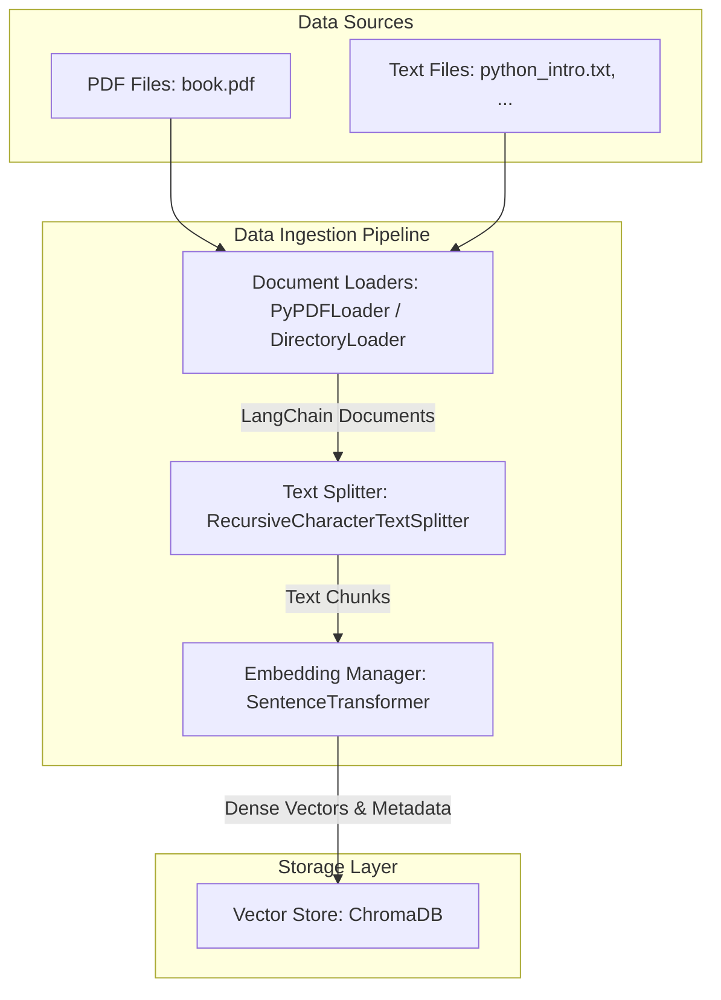
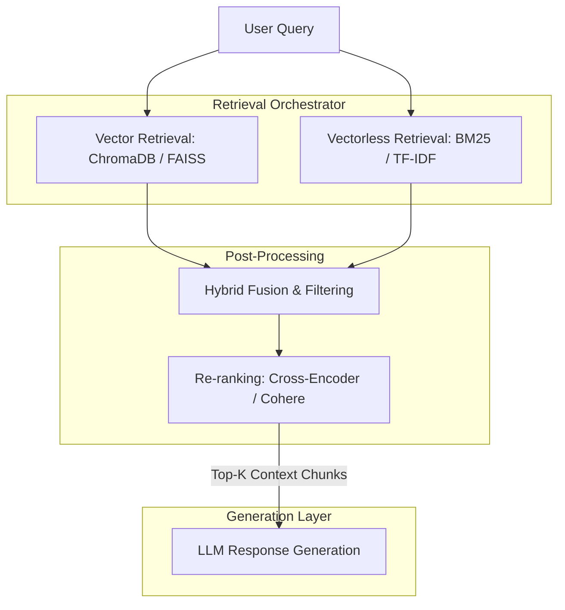

# System Design & RAG Ingestion Pipeline

This document details the system architecture, data flows, and component breakdown for the **RAG (Advanced and Vectorless)** project. 

---

## 1. System Architecture Overview

The system is designed as a modular Retrieval-Augmented Generation (RAG) framework, supporting ingestion, storage, and retrieval components. Currently, it focuses on a Python-based ingestion pipeline for structured and unstructured documents (PDFs and plain text), utilizing dense embeddings and a persistent vector database.

---

## 2. Ingestion Pipeline Components

### 2.1 Document Ingestion & Loading
* **Implementation Source:** [`notebook/pdf_loader.ipynb`](file:///c:/Users/hp/Desktop/Ai%20and%20agents/RAG%20(Advance%20and%20vectorless)/notebook/pdf_loader.ipynb) & [`notebook/document.ipynb`](file:///c:/Users/hp/Desktop/Ai%20and%20agents/RAG%20(Advance%20and%20vectorless)/notebook/document.ipynb)
* **Libraries:** `langchain-community`, `PyPDFLoader`, `DirectoryLoader`
* **Process:**
  1. Iterates recursively through directories to discover source files.
  2. Uses `PyPDFLoader` for PDF documents to parse text page-by-page.
  3. Uses `DirectoryLoader` with a `TextLoader` fallback to read raw txt files.
  4. Appends critical metadata to loaded documents, including `source_file` and `file_type`.

### 2.2 Document Chunking / Splitting
* **Implementation Source:** [`notebook/pdf_loader.ipynb`](file:///c:/Users/hp/Desktop/Ai%20and%20agents/RAG%20(Advance%20and%20vectorless)/notebook/pdf_loader.ipynb#L105-L123)
* **Libraries:** `langchain-text-splitters`
* **Process:**
  * Uses `RecursiveCharacterTextSplitter` to divide loaded page documents into manageable segments.
  * **Default Configuration:**
    * `chunk_size`: `1000` characters
    * `chunk_overlap`: `200` characters
    * `separators`: `["\n\n", "\n", " ", ""]` (maintains paragraph and sentence boundaries where possible)

### 2.3 Embedding Management (`EmbeddingManager`)
* **Implementation Source:** [`notebook/pdf_loader.ipynb`](file:///c:/Users/hp/Desktop/Ai%20and%20agents/RAG%20(Advance%20and%20vectorless)/notebook/pdf_loader.ipynb#L1252-L1297)
* **Libraries:** `sentence-transformers`
* **Model:** `all-MiniLM-L6-v2` (384-dimensional dense vectors)
* **Design Pattern:** Object-oriented wrapper class.
  * **Loading efficiency:** Loads the model into memory only once upon instantiation.
  * **Dimensions checks:** Enables auto-validating downstream dimension requirements.
  * **Error isolation:** Wraps initialization in `try-except` blocks to prevent silent loading failures.

### 2.4 Vector Storage Layer (`VectorStore`)
* **Implementation Source:** [`notebook/pdf_loader.ipynb`](file:///c:/Users/hp/Desktop/Ai%20and%20agents/RAG%20(Advance%20and%20vectorless)/notebook/pdf_loader.ipynb#L1339-L1426)
* **Libraries:** `chromadb`
* **Process:**
  1. Instantiates a `chromadb.PersistentClient` targeting `data/vector_store`.
  2. Fetches or creates a collection named `pdf_documents`.
  3. Maps chunks to database entries, generating unique IDs (`doc_<uuid>_<index>`) and structured metadata (e.g. `doc_index`, `content length`).
  4. Performs bulk insertion of document text, corresponding dense embeddings, and associated metadata.

---

## 3. The "Advanced and Vectorless" Architecture (Future Blueprint)

To satisfy the **Advanced** and **Vectorless** paradigms, the system design will evolve beyond basic vector search.

### 3.1 What Makes it "Advanced"?
1. **Hybrid Retrieval (Dense + Sparse):**
   * Combining semantic search (dense embeddings via ChromaDB) with exact keyword match (sparse embeddings or lexical engines).
2. **Re-ranking (Cross-Encoders):**
   * Standard vector search is fast but may miss deep context. A secondary Re-ranking step using models like `ms-marco-MiniLM` evaluates the exact match probability of retrieved candidate chunks.
3. **Metadata Filtering:**
   * Restricting search spaces dynamically based on document constraints (e.g., searching only `file_type: 'pdf'`).

### 3.2 What Makes it "Vectorless"?
The "Vectorless" capability provides keyword-focused or relation-focused extraction techniques that bypass standard embedding projection:
1. **BM25 / TF-IDF Search:**
   * Purely statistical lexical match, ideal for exact term queries, code snippets, or serial codes where embeddings fail.
2. **Graph-structured Knowledge Indexing (GraphRAG):**
   * Grouping text chunks into entity-relation graphs. Searches traverse nodes and relationships rather than measuring cosine similarity in vector space.
3. **Direct Context Summarization:**
   * Utilizing long-context LLMs to digest raw, unindexed documents for queries that require overall synthesis rather than isolated semantic chunk retrieval.

---

## 4. Current Pipeline Code Analysis & Improvements

A review of the prototype code in [`notebook/pdf_loader.ipynb`](file:///c:/Users/hp/Desktop/Ai%20and%20agents/RAG%20(Advance%20and%20vectorless)/notebook/pdf_loader.ipynb#L1375-L1426) reveals several syntax errors and logical flaws that must be fixed when moving from Jupyter to production `main.py` execution:

### Identified Bugs in `VectorStore.add_documents`

| Line Number | Existing Code (with Bug) | Proposed Correction | Reason |
| :--- | :--- | :--- | :--- |
| **1389** | `metadata = []` | `metadatas = []` | Variable name collision with item `metadata` inside loop. |
| **1402** | `metadata.append(metadata)` | `metadatas.append(metadata)` | Calling `.append` on dict `metadata` causes an `AttributeError`. |
| **1408** | `embeddings_list.append(embeddings.tolist())` | `embeddings_list.append(emb.tolist())` | Appends the entire 2D matrix instead of the single iteration vector `emb`. |
| **1415** | `metadata = metadatas` | `metadatas = metadatas` | The ChromaDB collection `add` API expects the parameter name to be `metadatas`, not `metadata`. |
| **1418** | `len(documets)` | `len(documents)` | Typo causing `NameError`. |
| **1419** | `collenstion` | `collection` | Typo in print statement. |
